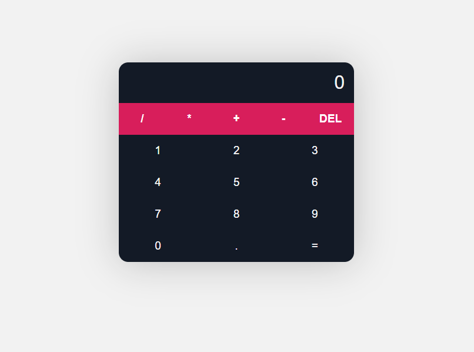

    

## - Objective ♟ 
The objective of this app was to create a site capable of making all types of calculations. It's a simple calculator but with a nice design, you can see it [running here](https://dtmoney-rocketseat.netlify.app/)
 

## - Technologies 🚀️
Project created React. I also used scss for the style. 
